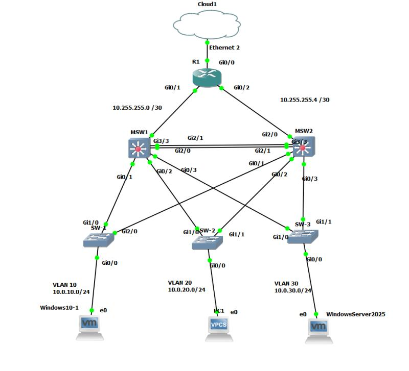

#  Projekt Sieci z Integracją Windows Server

## Opis projektu
Projekt przedstawia kompleksową konfigurację sieci LAN z naciskiem na wysoką dostępność (High Availability), redundancję oraz bezpieczeństwo. Środowisko sieciowe zostało zintegrowane z usługami serwerowymi opartymi na systemie Windows Server.

## Topologia sieci

* **Niezawodność w warstwie 2 (STP Load Balancing):** Aby zapobiec pętlom i optymalnie wykorzystać łącza, wdrożyłem **Rapid-PVST+**. Skonfigurowałem MSW1 jako Root Bridge dla VLAN 10 (Klienci) i 30 (Serwery), natomiast MSW2 jest Rootem dla VLAN 20 (Goście).
* **Agregacja łączy (LACP):** Kluczowe połączenia między przełącznikami wielowarstwowymi (MSW1 i MSW2) złączyłem w logiczny kanał (**EtherChannel/LACP**), zwiększając przepustowość i dodając redundancję.
* **Redundancja bramy domyślnej:** Na styku warstwy L2 i L3 wdrożyłem protokół **HSRP**, zapewniając stacjom końcowym niezawodny dostęp do bramy nawet w przypadku awarii jednego z głównych switchy.
* **Routing (OSPF) i wyjście na świat:** Komunikacja w rdzeniu opiera się na routingu dynamicznym **OSPF** (z adresacją /30 na łączach P2P do routera). Na routerze brzegowym (R1) uruchomiłem **PAT (NAT Overload)**, dając maszynom dostęp do Internetu.
* **Integracja z Windows Server:** Sieć to nie tylko urządzenia sieciowe. W VLAN 30 postawiłem działający **Windows Server**, który dostarcza usługi DHCP i DNS dla maszyn w innych segmentach sieci.

## Pliki w repozytorium
* `Projekt_Sieci.png` - Toplogia sieci
* `Konfiguracje` - Folder z plikami tekstowymi zawierającymi konfigurację (running-config) kluczowych urządzeń 
