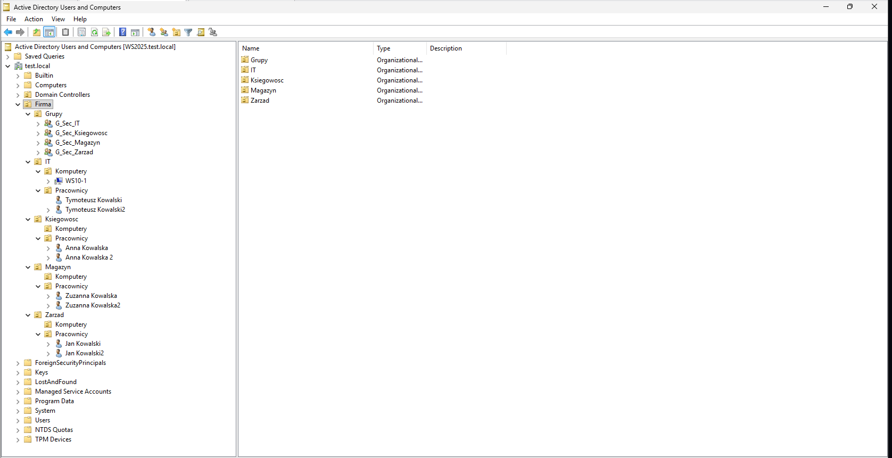

#  Projekt Sieci z Integracją Windows Server

## Opis projektu
Projekt przedstawia kompleksową konfigurację sieci LAN przedsiębiorstwa z naciskiem na wysoką dostępność (High Availability), redundancję oraz bezpieczeństwo. Środowisko sieciowe zostało zintegrowane z usługami serwerowymi opartymi na systemie Windows Server.

## Topologia sieci

* **Niezawodność w warstwie 2 (STP Load Balancing):** Aby zapobiec pętlom i optymalnie wykorzystać łącza, wdrożyłem **Rapid-PVST+**. Skonfigurowałem MSW1 jako Root Bridge dla VLAN 10 (Klienci) i 30 (Serwery), natomiast MSW2 jest Rootem dla VLAN 20 (Goście).
* **Agregacja łączy (LACP):** Kluczowe połączenia między przełącznikami wielowarstwowymi (MSW1 i MSW2) złączyłem w logiczny kanał (**EtherChannel/LACP**), zwiększając przepustowość i dodając redundancję.
* **Redundancja bramy domyślnej:** Na styku warstwy L2 i L3 wdrożyłem protokół **HSRP**, zapewniając stacjom końcowym niezawodny dostęp do bramy nawet w przypadku awarii jednego z głównych switchy.
* **Routing (OSPF) i wyjście na świat:** Komunikacja w rdzeniu opiera się na routingu dynamicznym **OSPF** (z adresacją /30 na łączach P2P do routera). Na routerze brzegowym (R1) uruchomiłem **PAT (NAT Overload)**, dając maszynom dostęp do Internetu.
* **Zabezpieczenia Warstwy Dostępowej (L2 Security):** Wdrożyłem rygorystyczne mechanizmy chroniące przed atakami w warstwie drugiej na przełącznikach dostępowych. Skonfigurowałem **DHCP Snooping** oraz **Dynamic ARP Inspection (DAI)** dla kluczowych sieci VLAN (10, 20, 30). Dostęp do portów brzegowych jest dodatkowo kontrolowany przez **Port Security** z restrykcyjnym limitem adresów MAC (opcja sticky).

### Integracja z Windows Server i Usługi Systemowe

* **Usługi Infrastrukturalne:** W VLAN 30 postawiłem działający **Windows Server**, który dostarcza kluczowe usługi **DHCP** i **DNS** dla maszyn w innych segmentach sieci.
* **Usługi Domenowe (Active Directory AD DS):** Wdrożono domenę korporacyjną oraz logiczną strukturę jednostek organizacyjnych (**OU**) odzwierciedlającą podział na działy firmy, wraz z zarządzaniem kontami użytkowników i komputerów.
* **Scentralizowane Zarządzanie i Bezpieczeństwo (GPO):** Skonfigurowano zasady grupy (**Group Policy Objects**) dla stacji roboczych z systemem Windows 10, w tym zaawansowane zasady audytu systemu (**Advanced Audit Policy**) monitorujące zdarzenia logowania i bezpieczeństwa.

## Pliki w repozytorium
* `Projekt_Sieci.png` - Toplogia sieci
* `Konfiguracje` - Folder z plikami tekstowymi zawierającymi konfigurację (running-config) kluczowych urządzeń 
### Integracja z Windows Server i Usługi Systemowe

* **Usługi Infrastrukturalne:** W VLAN 30 postawiłem działający **Windows Server**, który dostarcza kluczowe usługi **DHCP** i **DNS** dla maszyn w innych segmentach sieci.
* **Usługi Domenowe (Active Directory AD DS):** Wdrożono domenę korporacyjną oraz logiczną strukturę jednostek organizacyjnych (**OU**) odzwierciedlającą podział na działy firmy, wraz z zarządzaniem kontami użytkowników i komputerów.
  
  

* **Scentralizowane Zarządzanie i Bezpieczeństwo (GPO):** Skonfigurowano zasady grupy (**Group Policy Objects**) dla stacji roboczych z systemem Windows 10, w tym zaawansowane zasady audytu systemu (**Advanced Audit Policy**) monitorujące zdarzenia logowania i bezpieczeństwa.

  
