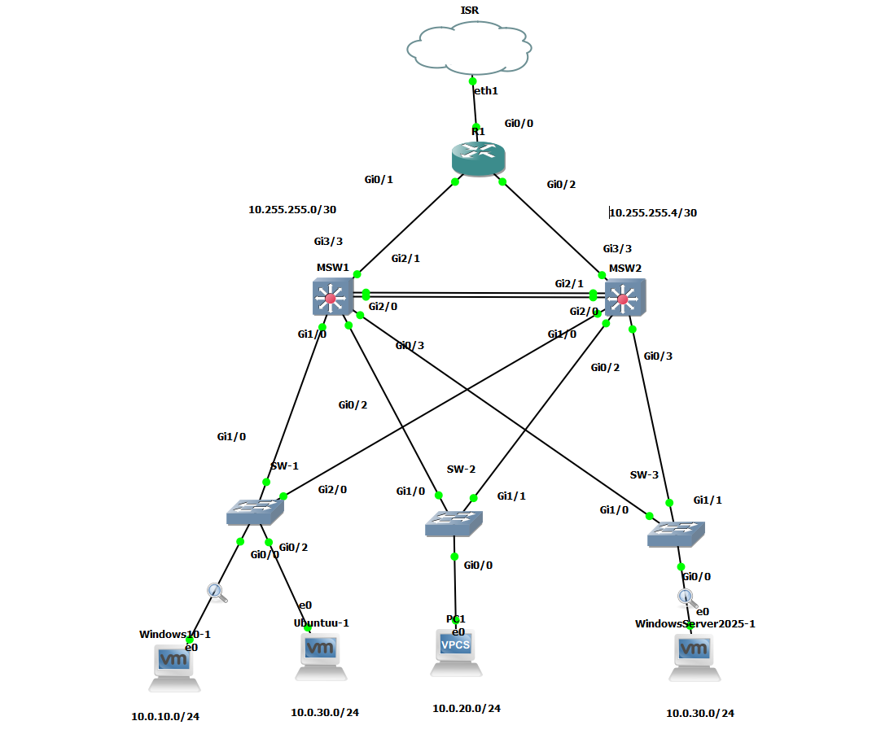
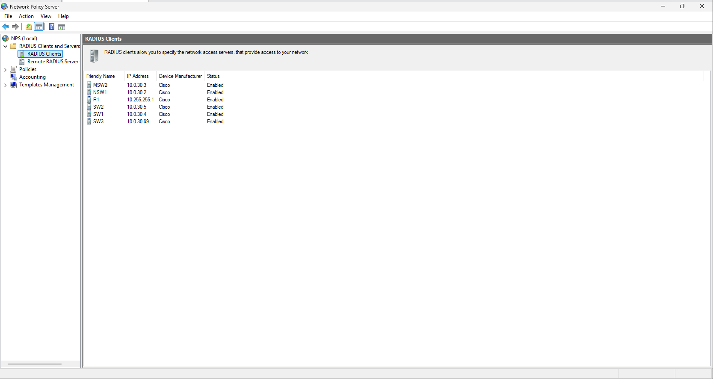
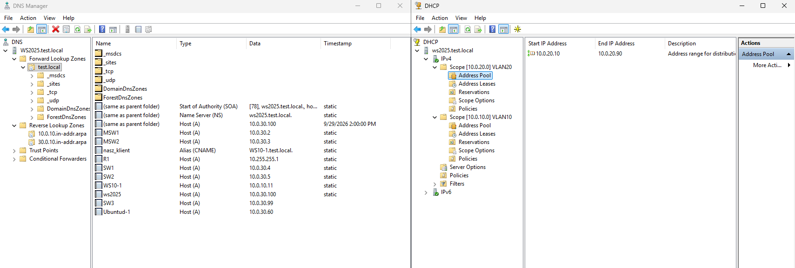
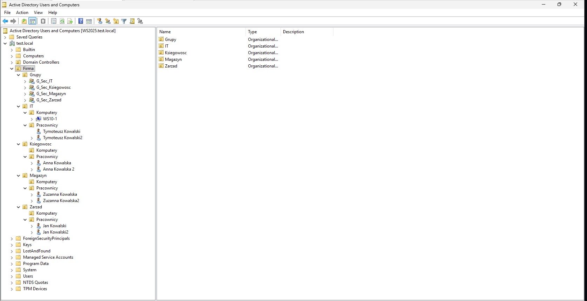
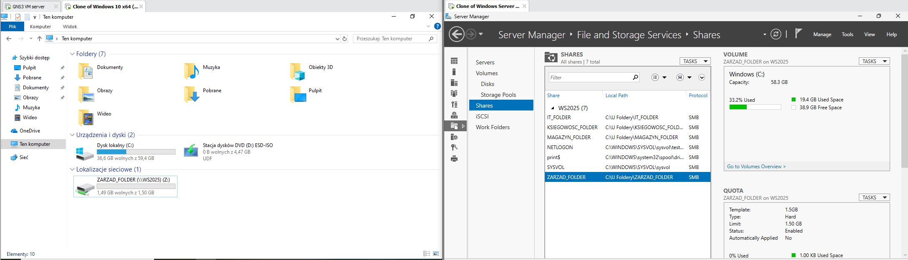
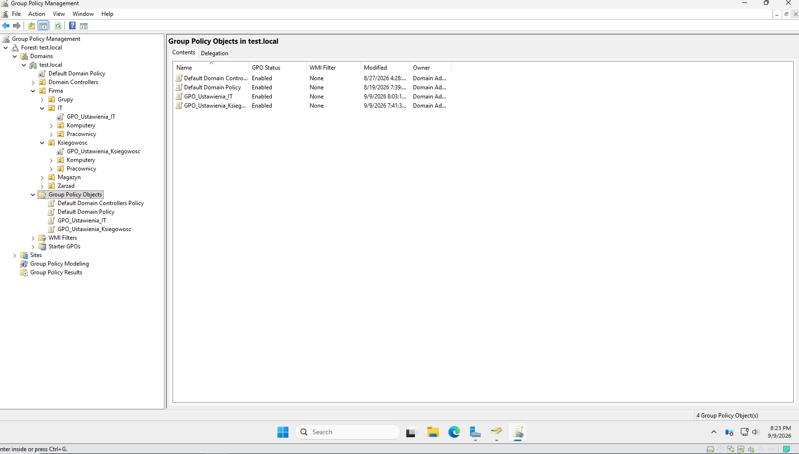
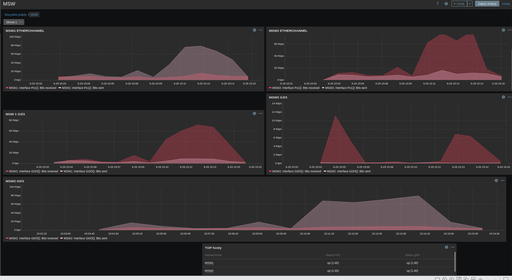
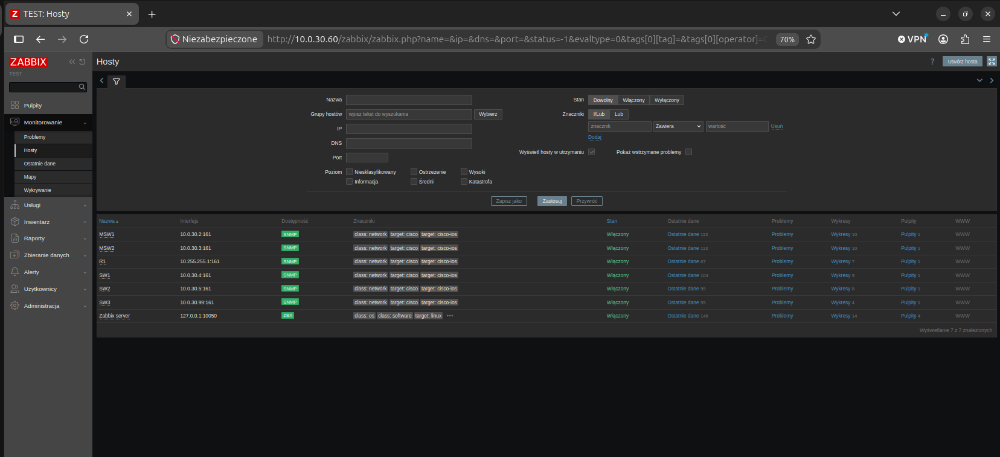

# Projekt Sieci z Integracją Windows Server

## Opis projektu
Projekt przedstawia konfigurację sieci LAN przedsiębiorstwa z naciskiem na wysoką dostępność (High Availability), redundancję oraz bezpieczeństwo. Środowisko sieciowe zintegrowałem z usługami serwerowymi opartymi na systemie Windows Server.

## Topologia sieci

* **Niezawodność w warstwie 2 (STP Load Balancing):** Aby zapobiec pętlom i optymalnie wykorzystać łącza, wdrożyłem **Rapid-PVST+**. Skonfigurowałem MSW1 jako Root Bridge dla VLAN 10 (Klienci) i 30 (Serwery), natomiast MSW2 jest Rootem dla VLAN 20 (Goście).
* **Agregacja łączy (LACP):** Kluczowe połączenia między przełącznikami wielowarstwowymi (MSW1 i MSW2) spiąłem w logiczny kanał (**EtherChannel/LACP**), zwiększając przepustowość i dodając redundancję.
* **Redundancja bramy domyślnej:** Na styku warstwy L2 i L3 wdrożyłem protokół **HSRP**, zapewniając stacjom końcowym niezawodny dostęp do bramy nawet w przypadku awarii jednego z głównych switchy.
* **Routing (OSPF) i wyjście na świat:** Komunikację w rdzeniu oparłem na routingu dynamicznym **OSPF** (z adresacją /30 na łączach P2P do routera). Na routerze brzegowym (R1) uruchomiłem **PAT (NAT Overload)**, dając maszynom dostęp do Internetu.
* **Zabezpieczenia Warstwy Dostępowej (L2 Security):** Wdrożyłem rygorystyczne mechanizmy chroniące przed atakami w warstwie drugiej na przełącznikach dostępowych. Skonfigurowałem **DHCP Snooping** oraz **Dynamic ARP Inspection (DAI)** dla kluczowych sieci VLAN (10, 20, 30). Dostęp do portów brzegowych zabezpieczyłem dodatkowo za pomocą **Port Security** z restrykcyjnym limitem adresów MAC (opcja sticky).
* **Scentralizowane uwierzytelnianie (AAA i RADIUS):** Wdrożyłem model AAA na urządzeniach sieciowych, integrując je z serwerem RADIUS działającym w środowisku Windows Server (NPS). Dostęp administracyjny weryfikuję w oparciu o poświadczenia domenowe, a w przypadku niedostępności serwera skonfigurowałem automatyczne przełączanie się urządzeń na lokalną bazę (Fallback).
  
  

### Integracja z Windows Server i Usługi Systemowe

* **Usługi Infrastrukturalne:** W VLAN 30 postawiłem działający **Windows Server**, który dostarcza kluczowe usługi **DHCP** i **DNS** dla maszyn w innych segmentach sieci.
  
* **Usługi Domenowe (Active Directory AD DS):** Wdrożyłem domenę korporacyjną oraz logiczną strukturę jednostek organizacyjnych (**OU**) odzwierciedlającą podział na działy firmy, wraz z zarządzaniem kontami użytkowników i komputerów.
  
  

* **Serwer Plików i Mapowanie Dysków (GPO):** Skonfigurowałem centralny serwer plików z odpowiednimi uprawnieniami dostępu (NTFS) podzielonymi na poszczególne działy. Zautomatyzowałem proces podłączania zasobów, wykorzystując zasady grupy (GPO) do dynamicznego mapowania dysków sieciowych po zalogowaniu użytkownika.

  

* **Scentralizowane Zarządzanie i Bezpieczeństwo (GPO):** Skonfigurowałem zasady grupy (**Group Policy Objects**) dla stacji roboczych z systemem Windows 10, w tym zaawansowane zasady audytu systemu (**Advanced Audit Policy**) monitorujące zdarzenia logowania i bezpieczeństwa.

  

## 📊 Monitorowanie Infrastruktury (Zabbix & Linux)

Środowisko rozbudowałem o system klasy NMS (Network Management System) w celu proaktywnego monitorowania stanu urządzeń sieciowych.

* **Serwer Monitoringu:** Wdrożyłem system operacyjny **Linux (Ubuntu)** oraz zainstalowałem i skonfigurowałem serwer **Zabbix**.
* **Integracja SNMP:** Skonfigurowałem protokół SNMP na urządzeniach Cisco (router brzegowy, przełączniki dystrybucyjne i dostępowe) w celu zdalnego zbierania metryk.
* **Wizualizacja i Dashboardy:** Utworzyłem dedykowane pulpity monitorujące w Zabbixie, które obejmują:
  * Obciążenie pasma na kluczowych łączach oraz zagregowanych portach (EtherChannel / Port-Channel).
  * Bieżący stan operacyjny (UP/DOWN) kluczowych interfejsów.

  
  
  

## Pliki w repozytorium
* `Konfiguracje` - Folder z plikami tekstowymi zawierającymi konfigurację (running-config) kluczowych urządzeń sieciowych.
* `screenshots` - Folder zawierający główny schemat topologii sieci oraz zrzuty ekranu dokumentujące poprawne działanie wdrożonych przeze mnie usług systemowych (AD, GPO, NPS) oraz monitoringu (Zabbix).
