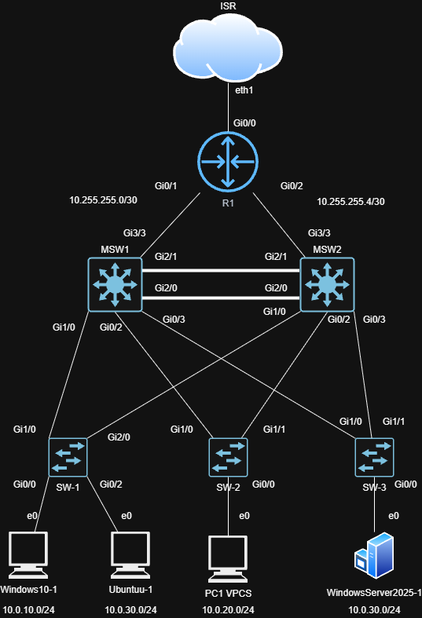

# Projekt Sieci z Integracją Windows Server

## Opis projektu
Projekt przedstawia kompleksową konfigurację sieci LAN przedsiębiorstwa z naciskiem na wysoką dostępność (High Availability) oraz redundancję. Środowisko sieciowe oparto na emulatorze GNS3 i zintegrowano z usługami serwerowymi na bazie systemu Windows Server oraz systemem monitorowania Zabbix (Linux).

## Topologia sieci

  

### Architektura Adresacji i VLAN

| ID VLAN | Nazwa VLAN  | Podsieć IP   | Opis / Usługi Systemowe                                |
|---------|-------------|--------------|--------------------------------------------------------|
| 10      | UZYTKOWNICY | 10.0.10.0/24 | Stacje robocze, strefa chroniona (DHCP Snooping, DAI)  |
| 20      | GOSCIE      | 10.0.20.0/24 | Izolowany dostęp dla gości, ograniczony ruch sieciowy  |
| 30      | SERWERY     | 10.0.30.0/24 | Windows Server (Active Directory, DHCP, DNS, GPO)      |
| 40      | ZARZADZANIE | 10.0.40.0/24 | Linux (Zabbix), dedykowany interfejs zarządzający urządzeniami Cisco |

### Kluczowe Technologie i Protokoły Sieciowe

* **Niezawodność w warstwie 2 (STP Load Balancing):** Aby zapobiec pętlom i optymalnie wykorzystać łącza, wdrożyłem **Rapid-PVST+**. Rozłożyłem obciążenie wskazując MSW1 jako Root Bridge dla VLAN 10 (Klienci) i 30 (Serwery), natomiast przełącznik MSW2 funkcjonuje jako Root dla VLAN 20 (Goście).
* **Agregacja łączy (LACP):** Połączenia krzyżowe między przełącznikami rdzeniowymi/dystrybucyjnymi (MSW1 i MSW2) spiąłem w logiczny kanał **EtherChannel/LACP** w trybie Active, zwiększając przepustowość i dodając tolerancję na awarię fizycznych interfejsów.
* **Redundancja bramy domyślnej (HSRP):** Na styku warstwy L2 i L3 wdrożyłem protokół **HSRP** ze śledzeniem priorytetów (Preempt). MSW1 działa jako aktywna brama dla użytkowników i serwerów (VLAN 10, 30), a MSW2 dla gości (VLAN 20), zapewniając ciągłość działania sieci.
* **Bezpieczny routing OSPF w warstwie rdzenia:** Komunikację w rdzeniu oparłem na routingu dynamicznym **OSPF** (z adresacją /30 na łączach P2P do routera). W celu zabezpieczenia topologii przed wstrzykiwaniem fałszywych tras, interfejsy skierowane do sieci LAN (VLAN 10, 20, 30) ustawiłem jako **Passive-Interfaces**.
* **Translacja Adresów i Filtracja (NAT/ACL):** Na routerze brzegowym (R1) uruchomiłem **PAT (NAT Overload)**. Dodatkowo wykorzystałem listy dostępu (ACL), np. całkowicie odcinając segment serwerów (VLAN 30) od wyjścia do strefy publicznej.

### Zabezpieczenia (NetSec) i Uwierzytelnianie

* **Zabezpieczenia Warstwy Dostępowej (L2 Security):** Wdrożyłem rygorystyczne mechanizmy ochrony na przełącznikach dostępowych (SW1, SW2, SW3). Sieć chroniona jest przez **DHCP Snooping** oraz **Dynamic ARP Inspection (DAI)**, a ruch kontrolny serwera przepuszczany jest dzięki konfiguracji `dhcp relay information trust-all` na warstwie dystrybucyjnej. Porty brzegowe ograniczyłem za pomocą **Port Security** (mechanizm Sticky MAC z restrykcyjnym limitem 3-5 urządzeń).
* **Scentralizowane uwierzytelnianie (AAA i RADIUS):** Zarządzanie urządzeniami zabezpieczono modelem **AAA**, zintegrowanym z serwerem Windows Server (NPS). Uprawnienia administratorów bazują na kontach z Active Directory z wdrożonym systemem bazy awaryjnej (Local Fallback) na wypadek odcięcia serwera.
* **Hardenizacja Protokołów (SSHv2 & SNMPv3):** Tradycyjne metody zarządzania zastąpiono standardami bezpiecznymi. Dostęp do CLI realizowany jest wyłącznie przez **SSHv2 z wyłącznym wsparciem dla silnych algorytmów AES** (128/192/256-ctr). Telemetria działa w oparciu o bezpieczny wariant **SNMPv3 (authPriv)**, a samo pobieranie metryk ograniczone jest regułami ACL tylko do podsieci zarządzania (VLAN 40).
  
  

## Integracja z Windows Server i Usługi Systemowe

* **Usługi Infrastrukturalne:** W VLAN 30 postawiłem działający **Windows Server**, który dostarcza scentralizowane usługi **DHCP** (z forwardowaniem ip helper-address) i **DNS** dla maszyn w pozostałych segmentach sieci.
  
  
  
* **Usługi Domenowe (Active Directory AD DS):** Wdrożyłem domenę korporacyjną oraz logiczną strukturę jednostek organizacyjnych (**OU**) odzwierciedlającą podział na działy firmy, wraz z zarządzaniem kontami użytkowników i komputerów.
  
  

* **Serwer Plików i Mapowanie Dysków (GPO):** Skonfigurowałem centralny serwer plików z odpowiednimi uprawnieniami dostępu (NTFS) podzielonymi na poszczególne działy. Zautomatyzowałem proces podłączania zasobów, wykorzystując zasady grupy (GPO) do dynamicznego mapowania dysków sieciowych po zalogowaniu użytkownika.

  

* **Scentralizowane Zarządzanie (GPO):** Skonfigurowałem zasady grupy (**Group Policy Objects**) dla stacji roboczych z systemem Windows 10, w tym zaawansowane zasady audytu systemu (**Advanced Audit Policy**) monitorujące zdarzenia logowania i bezpieczeństwa.

  

## 📊 Monitorowanie Infrastruktury (Zabbix & Linux)

Środowisko rozbudowałem o system klasy NMS (Network Management System) w izolowanej sieci zarządzania (VLAN 40) w celu proaktywnego monitorowania stanu urządzeń sieciowych.

* **Serwer Monitoringu:** Wdrożyłem system operacyjny **Linux (Ubuntu)** oraz zainstalowałem i skonfigurowałem serwer **Zabbix**.
* **Integracja SNMPv3:** Skonfigurowałem uwierzytelniony i szyfrowany protokół SNMPv3 na urządzeniach Cisco (router brzegowy, przełączniki dystrybucyjne i dostępowe) do agregacji logów systemowych i sprzętowych.
* **Wizualizacja i Dashboardy:** Utworzyłem dedykowane pulpity monitorujące w Zabbixie, które obejmują:
  * Obciążenie pasma na kluczowych łączach oraz zagregowanych portach (EtherChannel).
  * Bieżący stan operacyjny (UP/DOWN) kluczowych interfejsów i systemów chłodzenia.

  
  
  

## Pliki w repozytorium

| Nazwa Katalogu | Zawartość i Przeznaczenie |
|----------------|---------------------------|
| `Konfiguracje` | Folder z plikami tekstowymi zawierającymi zrzuconą konfigurację sprzętową (`running-config`) kluczowych urządzeń (Router, MSW1, MSW2, SW). |
| `screenshots`  | Zrzuty ekranu dokumentujące poprawne działanie usług systemowych (AD, GPO, NPS) oraz paneli monitoringu Zabbix. |
